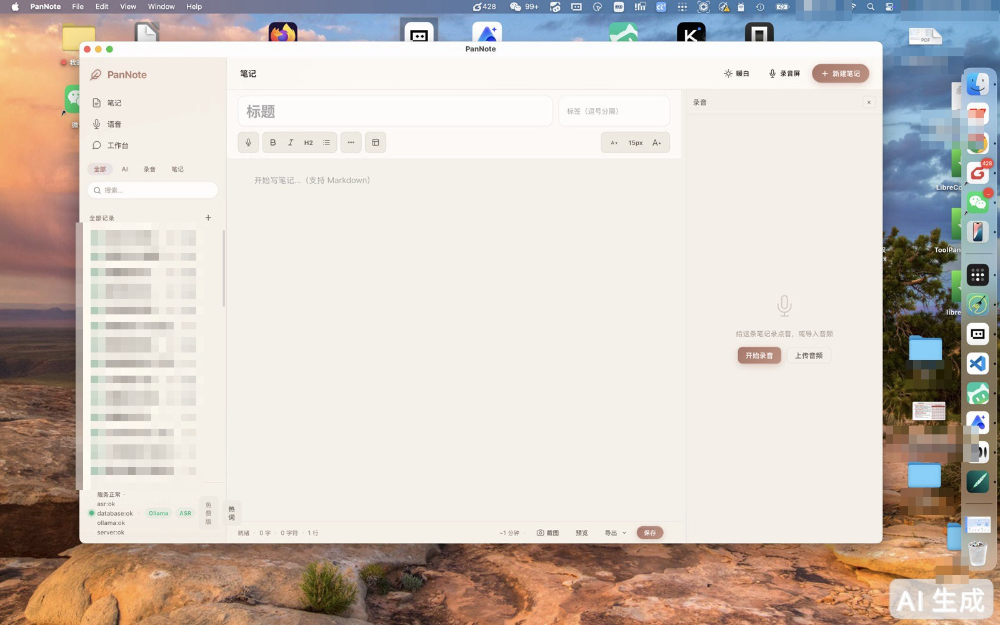
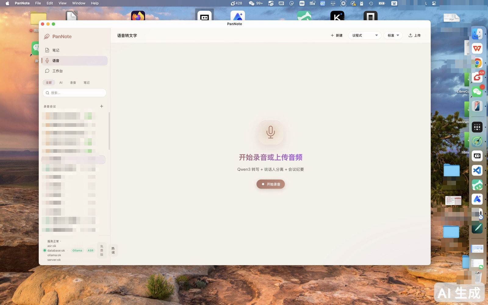

---
AIGC:
  ContentProducer: '001191110102MAD55U9H0F10002'
  ContentPropagator: '001191110102MAD55U9H0F10002'
  Label: '1'
  ProduceID: '95a19d0a-6c93-4582-9889-cb544a08d800'
  PropagateID: '95a19d0a-6c93-4582-9889-cb544a08d800'
  ReservedCode1: '01dcd830-76c0-4ce4-9c56-2c84acd89ad6'
  ReservedCode2: '01dcd830-76c0-4ce4-9c56-2c84acd89ad6'
---

<div align="center">

# PanNote (笔尖)

**本地优先的会议录音 · 转写 · AI 纪要工作台**

Local-first meeting recording, transcription & AI notes workspace

[]()
[]()
[]()

</div>

---

<div align="center">

**为什么做 PanNote？会议内容属于你自己。**

*Why PanNote? Your meeting content belongs to you.*

</div>

## 这是什么 / What is this

PanNote 是一个运行在你自己电脑上的会议工作台：录音、实时转写、AI 生成纪要、笔记管理，全部在本地完成。不需要把会议录音上传到任何云端服务。

PanNote is a meeting workspace that runs entirely on your own computer: recording, real-time transcription, AI-powered summaries, and notes — all local. No meeting audio ever leaves your machine.





## 核心能力 / Key Features

| 功能 Feature | 说明 Description |
|---|---|
| **本地录音** | 会议录音直接存本机，无需上传<br>Recording stays on your machine |
| **实时转写** | 10 秒分段流式转写，支持热词纠正、静音检测、失败自动重试<br>Segmented streaming transcription with hotword correction, silence detection, auto-retry |
| **AI 纪要** | 本地 4B 模型生成结构化纪要（概要/议题/结论/行动项），支持多种会议类型模板<br>Structured summaries via local 4B model, multiple meeting-type templates |
| **说话人分离** | 声纹注册 + 说话人识别，区分不同发言人<br>Voiceprint enrollment & speaker identification |
| **纪要导出** | 一键导出 Word (.docx) / Markdown，直接进 OA<br>One-click export to Word (.docx) / Markdown |
| **热词自学习** | 编辑转写时自动学习错词纠正，越用越准<br>Learns corrections from your edits, gets smarter over time |
| **全文搜索** | 笔记、转写、纪要全文 FTS 检索<br>Full-text search across notes, transcripts, summaries |
| **数据防线** | 段级持久化 + 差集补跑 + 每日自动备份（数据库 + 近 7 天音频）<br>Segment-level persistence, backfill, daily auto-backup |

## 隐私边界 / Privacy Boundary

我们不说"绝对安全"，只说事实：

We don't claim "absolute security" — we state facts:

- ✅ **录音、转写、纪要、笔记**：全部本地处理，不上传<br>Recording, transcription, summaries, notes: all processed locally
- ⚠️ **数据库未加密**：本地 SQLite，依赖磁盘加密和账户保护<br>Database is unencrypted local SQLite; relies on disk encryption & account security
- ⚠️ **联网搜索**：仅用户主动触发时，搜索词会发送给搜索服务商<br>Web search (user-triggered only) sends query terms to the search provider
- ⚠️ **自定义 Ollama 地址**：如果配置为远程地址，内容会发往该地址<br>A remote Ollama URL would send content to that endpoint

详见 / See [docs/PRIVACY.md](docs/PRIVACY.md)

## 当前状态 / Current Status

> ✅ **v1.0.0 已发布** — [下载 macOS 安装包](https://github.com/maoxiao2025/PanNote/releases/latest)
>
> **v1.0.0 released** — [Download the macOS installer](https://github.com/maoxiao2025/PanNote/releases/latest)

安装包内置嵌入式转写引擎（Paraformer + 标点 + VAD，约 373MB），**安装即用，无需 Python**。录音、转写、纪要全部本地完成。

The installer bundles an embedded ASR engine (Paraformer + punctuation + VAD, ~373MB) — **ready out of the box, no Python required**. Recording, transcription and summaries all run locally.

从源码构建（开发者）：

Building from source (developers):

- macOS + Xcode Command Line Tools
- Rust stable + Tauri v2 CLI
- Node.js + npm
- （可选）Python 3 + ASR 服务，用于 HTTP 兼容链路 / Optional: Python 3 + ASR service for the HTTP-compatible path
- Ollama + 本地 4B 模型（用于纪要功能）

```bash
npm ci && npm run build
cargo test --all-targets
cargo tauri build
```

**下载 ZIP 只是源码，不是安装包**；安装包在 [Releases 页面](https://github.com/maoxiao2025/PanNote/releases/latest)。

## 技术架构 / Tech Stack

```
┌─────────────────────────────────────────┐
│           Tauri v2 (Rust + Web)          │
├─────────────────────────────────────────┤
│  录音采集 cpal │ 状态机 │ 段级持久化      │
├─────────────────────────────────────────┤
│  ASR: 嵌入式 sherpa-rs (打包内置)      │
│  LLM: Ollama /api/chat (本地 4B)        │
├─────────────────────────────────────────┤
│  SQLite (sqlx) │ FTS 全文搜索 │ 备份     │
└─────────────────────────────────────────┘
```

- **录音链路**：cpal 采集 → 10s 段落 WAV → 八态状态机 → 段级持久化（done/failed/silent/pending/processing）
- **转写引擎**：嵌入式 Paraformer（打包内置，实测 RTF 0.045 实时无积压）；HTTP 服务模式兼容旧链路
- **可靠性工程**：差集补跑、worker 租约、一致性巡检、每日自动备份、磁盘水位归档

## 路线图 / Roadmap

- [x] v2.5.0 可靠性工程（段级持久化/状态机/补跑）
- [x] v2.6.0 可靠性产品化（失败重试/fallback 可见/纪要门槛/导出/健康面板）
- [x] **产品版 v1.0**：ASR 嵌入式（消除 Python 依赖）+ 一键安装包（内置模型）
- [ ] 跨平台（Windows / Linux）
- [ ] 本地 4B 可选 + 云端降级（无本地算力时）
- [ ] 精简版安装包（模型改为首次启动下载，体积 -373MB）

详见 / See [CHANGELOG.md](CHANGELOG.md)

## 反馈 / Feedback

- 发现问题？[提交 Issue](https://github.com/maoxiao2025/PanNote/issues)
- 测试请用**合成音频或已授权素材**，不要用涉密内容
- Please use **synthetic or authorized audio** for testing

## License

MIT — 详见 [LICENSE](LICENSE)。第三方模型和运行时可能有独立的分发条款，本仓库许可不授予其再分发权。

MIT — see [LICENSE](LICENSE). Third-party models and runtimes may have separate terms; this license does not grant rights to redistribute them.

> AI生成